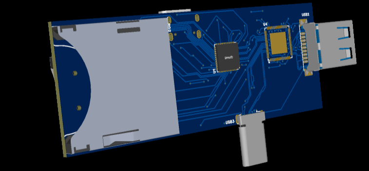
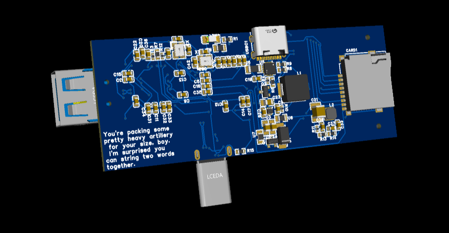
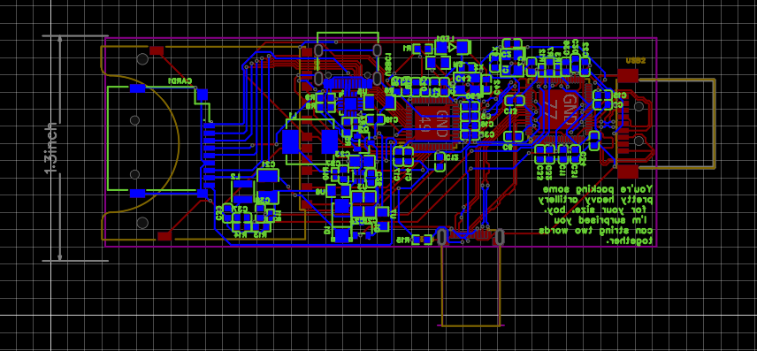
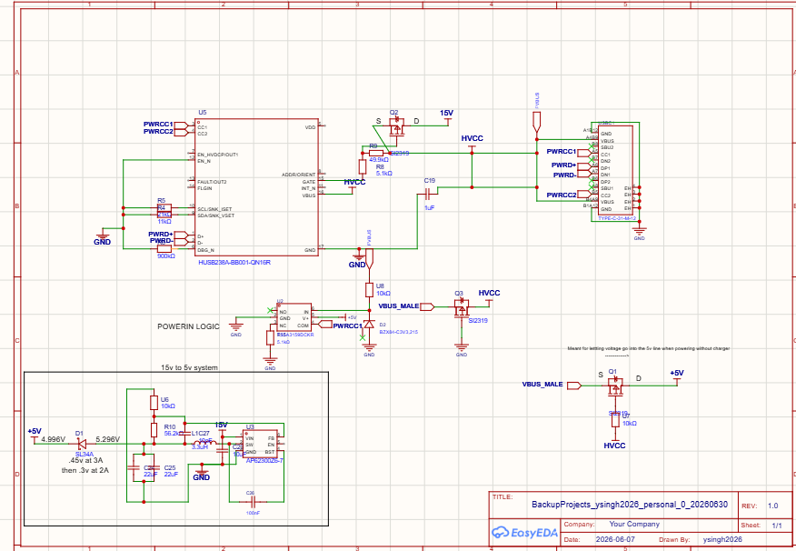
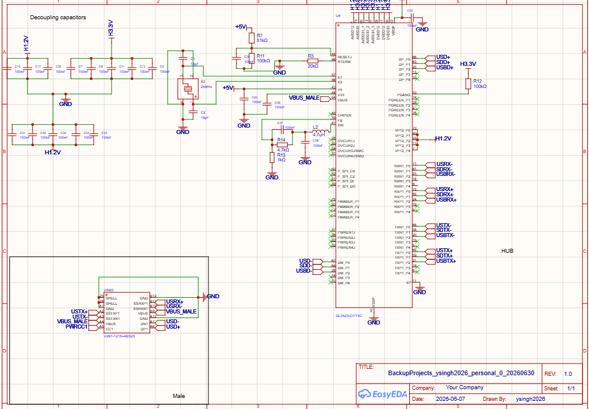
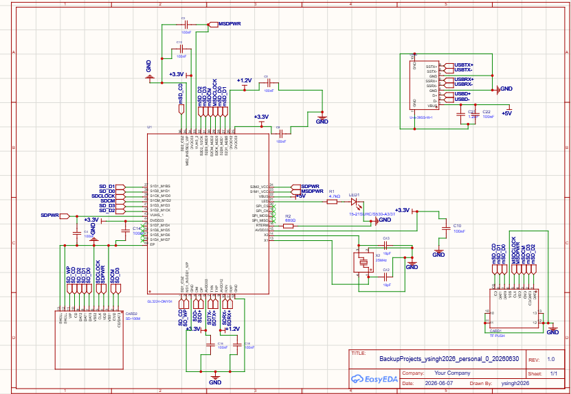

  # Relic

Relic is a custom USB-C hardware prototype and PCB design exploration focused on building a small hub / power-delivery interface with USB data routing, charging logic, and power switching. This is meant for the steamdeck, but it can also be used laptops or phones.

## Project summary

This design appears to be an experimental USB-C board intended to support:

- USB-C power delivery / sink behavior
- Dual-voltage switching and protection logic
- USB data connectivity for downstream ports
- A hub-style layout for a host device such as a Steam Deck or laptop
- Decoupling and filtering for clean power delivery
- Optional SD card / high-speed USB data paths

The project is clearly in an iterative prototype stage rather than a finished commercial product. Many notes in the journal describe design changes, troubleshooting, and revisions while working through USB-C CC pin behavior, PD negotiation, MOSFET switching, and routing choices.

## 3d View

  

No explicit license was provided in the workspace. If you intend to share or manufacture this design, confirm the legal and licensing requirements before distributing or commercializing the PCB files.
